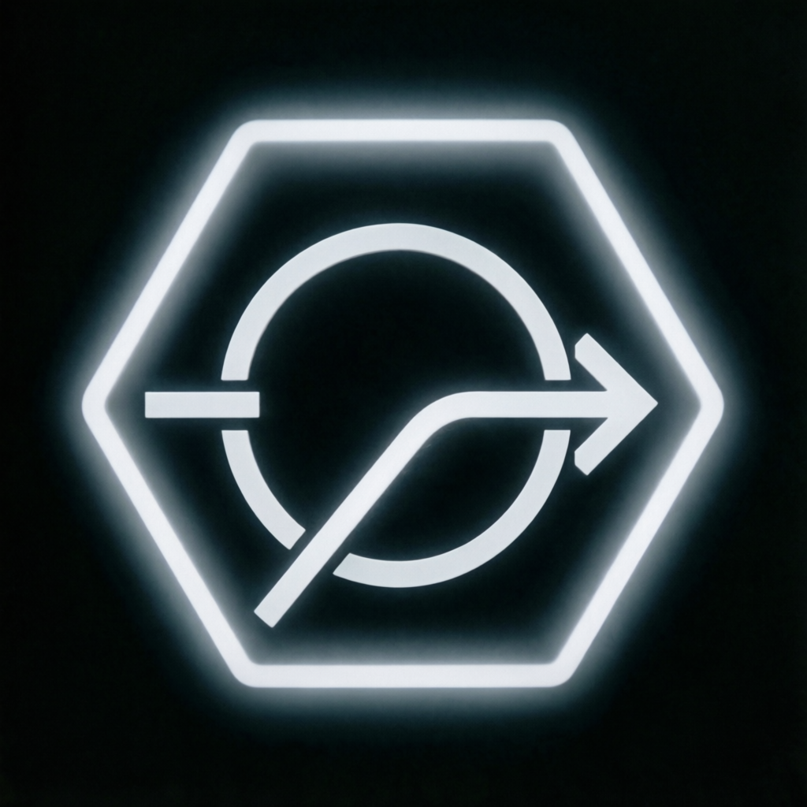
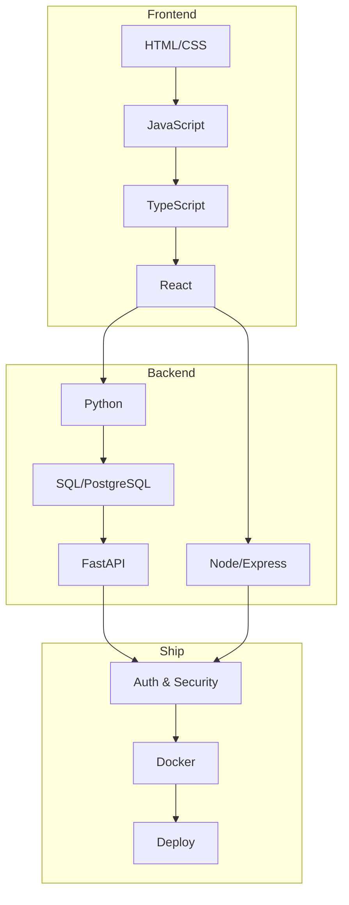

# web-roadmap

Бесплатный структурированный роадмап **full-stack веб-разработки**: от HTML до деплоя production-приложения.

<p align="center">
  
</p>

<p align="center">
  <a href="roadmap/README.md"><strong>Начать обучение</strong></a> ·
  <a href="docs/getting-started.md">Как учиться</a> ·
  <a href="docs/resources.md">Ресурсы</a> ·
  <a href="CONTRIBUTING.md">Contributing</a>
</p>

<p align="center">
  
  
  
  
</p>

---

## О проекте

**web-roadmap** — открытый учебный маршрут для тех, кто хочет стать **junior full-stack разработчиком** с нуля или систематизировать пробелы. Не курс с видео, а **пошаговый план**: теория → практика → проект недели → самопроверка.

Вдохновлено форматом [roadmap.sh](https://github.com/nilbuild/developer-roadmap), [React Developer Roadmap](https://github.com/adam-golab/react-developer-roadmap) и [Python-Roadmap](https://github.com/GnuriaN/Python-Roadmap), но сфокусировано на **практике 6–7 часов в день** и связном пути к full-stack.

### Стек

```
HTML → CSS → Git → JavaScript → TypeScript → React
  → Python → SQL/PostgreSQL → FastAPI
  → Node.js/Express → Auth & Testing → Docker → Deploy
```

### Для кого

| Аудитория | Зачем |
|-----------|--------|
| Новички | Понятный путь без хаоса «что учить дальше» |
| Самоучки | Структура, проекты, чеклисты, литература |
| Junior'ы | Закрыть пробелы в фундаменте и full-stack связке |

### Что внутри

- **154 учебных дня** (22 недели × 7 дней)
- Ежедневные блоки: **теория**, **практика**, **ловушки**, **ревью**
- **22 проекта недели** + финальный capstone
- Ссылки на MDN, learn.javascript.ru, react.dev, FastAPI, Docker и книги
- Протокол **«анти-вайбкодер»** — учиться понимать, а не копировать ИИ

---

## Карта маршрута (22 недели)

| Нед. | Тема | Файл |
|------|------|------|
| 1 | HTML: структура, семантика, формы, a11y | [week-01](roadmap/weeks/week-01.md) |
| 2 | CSS: селекторы, box model, типографика | [week-02](roadmap/weeks/week-02.md) |
| 3 | CSS: Flexbox, Grid, адаптив, анимации | [week-03](roadmap/weeks/week-03.md) |
| 4 | Git, GitHub, DevTools, workflow | [week-04](roadmap/weeks/week-04.md) |
| 5 | JavaScript: основы | [week-05](roadmap/weeks/week-05.md) |
| 6 | JavaScript: объекты, DOM, события | [week-06](roadmap/weeks/week-06.md) |
| 7 | JS: storage, Fetch, формы, модули | [week-07](roadmap/weeks/week-07.md) |
| 8 | Async JS, Event Loop, HTTP, API | [week-08](roadmap/weeks/week-08.md) |
| 9 | JS advanced: closures, ООП, паттерны | [week-09](roadmap/weeks/week-09.md) |
| 10 | TypeScript | [week-10](roadmap/weeks/week-10.md) |
| 11 | React: основы, JSX, компоненты | [week-11](roadmap/weeks/week-11.md) |
| 12 | React: state, effects, формы | [week-12](roadmap/weeks/week-12.md) |
| 13 | React Router, hooks, Context | [week-13](roadmap/weeks/week-13.md) |
| 14 | **Проект:** Frontend SPA | [week-14](roadmap/weeks/week-14.md) |
| 15 | Python: основы, venv | [week-15](roadmap/weeks/week-15.md) |
| 16 | Python: ООП, алгоритмы, файлы | [week-16](roadmap/weeks/week-16.md) |
| 17 | SQL и PostgreSQL | [week-17](roadmap/weeks/week-17.md) |
| 18 | SQLAlchemy + FastAPI | [week-18](roadmap/weeks/week-18.md) |
| 19 | Node.js + Express | [week-19](roadmap/weeks/week-19.md) |
| 20 | Auth, безопасность, тестирование | [week-20](roadmap/weeks/week-20.md) |
| 21 | Full-stack + Docker | [week-21](roadmap/weeks/week-21.md) |
| 22 | **Финал:** деплой, портфолио, карьера | [week-22](roadmap/weeks/week-22.md) |



---

## Быстрый старт

1. Прочитай [docs/getting-started.md](docs/getting-started.md) — инструменты, распорядок дня, GitHub
2. Открой [roadmap/introduction.md](roadmap/introduction.md) — принципы и «анти-вайбкодер»
3. Начни с [roadmap/weeks/week-01.md](roadmap/weeks/week-01.md)
4. Веди репозиторий `learning-log` на GitHub: коммит каждый день

---

## Дисклеймер

> Этот роадмап показывает **ландшафт** full-stack разработки и порядок тем. Цель — понять, *что* и *зачем* учить, а не гнаться за хайпом. Инструменты меняются; фундамент (HTTP, DOM, SQL, компоненты, API) остаётся.

---

## Contributing

Исправления, новые задания и ссылки — через [Issues](https://github.com/krwg/web-roadmap/issues) и [Pull Requests](https://github.com/krwg/web-roadmap/pulls). См. [CONTRIBUTING.md](CONTRIBUTING.md).

---

## License

Материалы защищены авторским правом. Личное использование — да; публикация контента отдельно от репозитория — только с согласия автора. Подробности в [license](license).

Copyright © 2026 krwg
